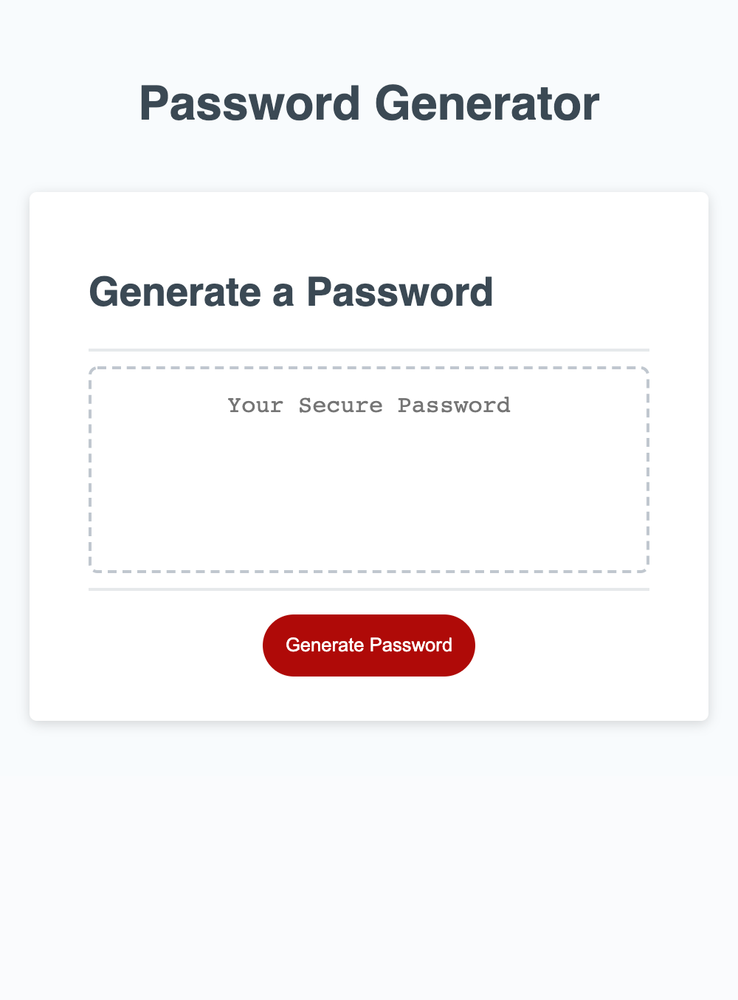

# HOMEWORK3_PASSWORD_GENERATOR

# DESCRIPTION
- The purpose of this homework was to allow the red generate button to generate a random password.
    - Window prompt for password length (if a a number is entered outside of that range, an alert will appear)
    - Window confirm for lowercase, uppercase, and special characters (if user click OK those will be applied, if user clicks cancel they will not be applied to the password)
# Link

# SCREENSHOT

# HELP / ASSISTANCE
- TA(Christian)
- Tutor
- Study group